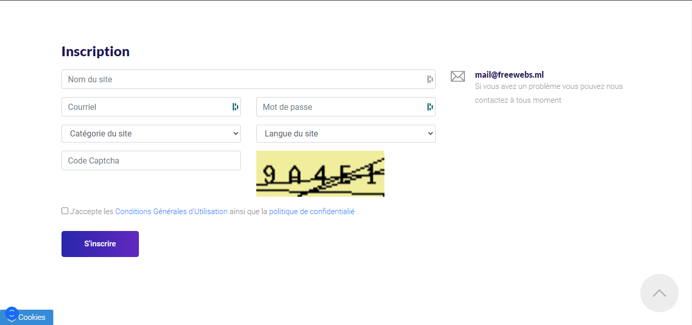
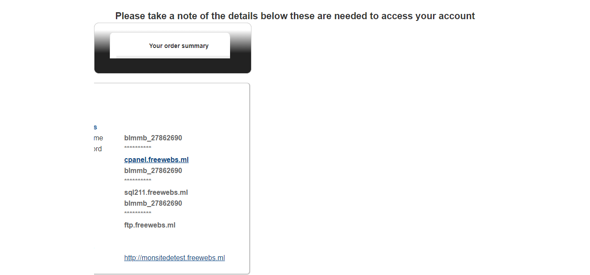

# Inscription

## Pré-requis

Premièrement, vous aurez besoin d'une adresse mail valide

## Étape 1

Rendez vous sur cette [page](https://www.freewebs.ml/fr-fr/inscription), elle devrait contenir un formulaire ressemblant à ceci &#x20;

## Étape 2

Remplissez le formulaire avec les informations demandées et cliquez sur "**S'inscrire**"

## Étape 3

Une fois le formulaire envoyé, vous arriverez sur cette page qui vous demandera de cliquez sur le lien de vérification qui vous a été envoyé par e-mail

.png>)

## Étape 4

Rendez-vous donc sur votre messagerie mail et vérifier si vous avez un message de **noreply@hostmessage.info**, si oui, ouvrez-le

.png>)


Si vous ne voyez pas le mail, essayez de le chercher dans vos spams.


## Étape 5

Une fois que vous avez ouvert votre mail, cliquez sur le lien qui est dessus, celui qui commence par **http://order.freewebs.ml/activate.php**

.png>)

## É**tape 6**

Un nouvel onglet devrait s'ouvir qui engagera le processus final d'inscription, patientez quelques instants

.png>)


Vous recevrez un autre récapitulatif de l'inscription par mail de **noreply@hostmessage.info**


